# msc-project
# 

### Structure of this project:

### Metrics for Umpire/Nonumpire detection model
- Training
  - model was trained with 951 images
  - data split as shown in image 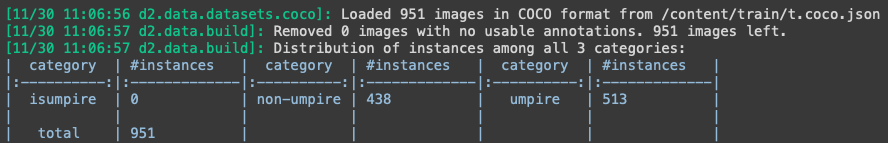
- Validation
  - model was validated against 90 images
  - data split as shown in image 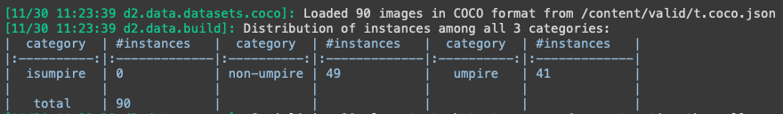
- Test
  - model was tested against 45 images
  - data split as shown in image 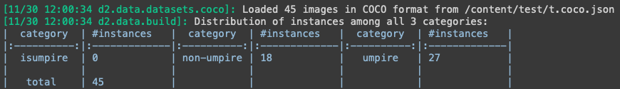
- Model Evaluation
  - After 1000 iteration, AP as shown below
    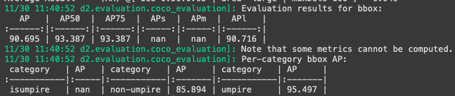
  - After 1500 iteration, AP as shown below
    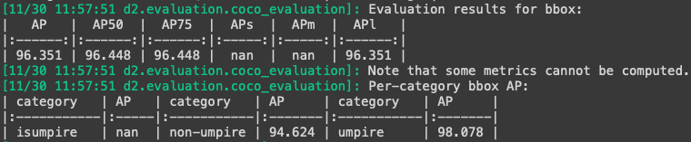
  - Final evaluation based on the test data, AP as shown below
    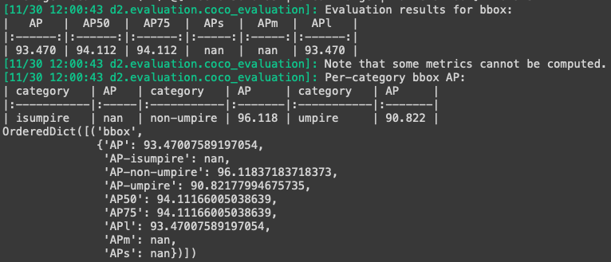


### Metrics for Umpire signs/pose (SIX, NO-BALL, OUT, WIDE) detection model
- Training
  - model was trained with 930 images
  - data split as shown in image 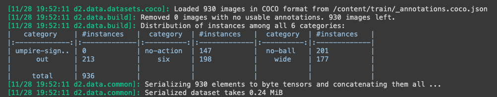
- Validation
  - model was validated against 88 images
  - data split as shown in image 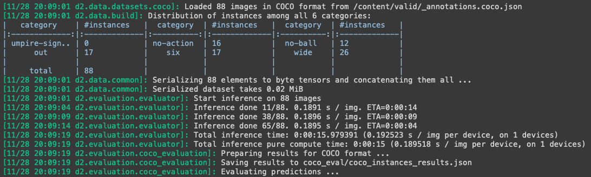
- Test
  - model was tested against 44 images
  - data split as shown in image 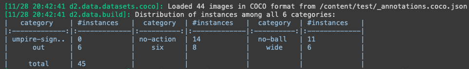
- Model Evaluation
  - After 1000 iteration, AP as shown below
    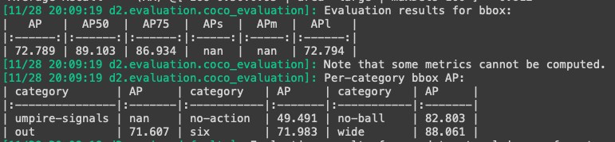
  - After 1500 iteration, AP as shown below
    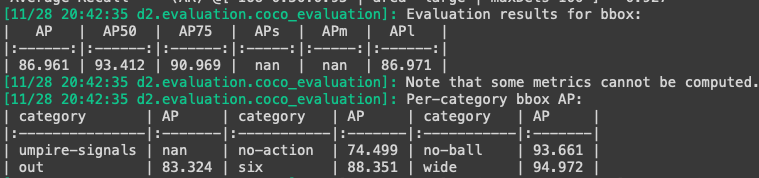
  - Final evaluation based on the test data, AP as shown below
    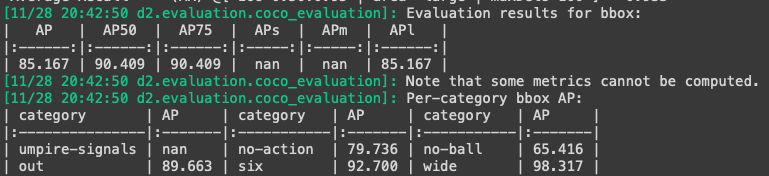


### Interpreting detectron2 prediction result
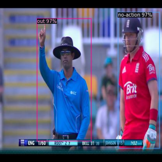
```
{
  'instances': Instances(
    num_instances=2, 
    image_height=416, 
    image_width=416, 
    fields=[
      pred_boxes: Boxes(
        tensor([
          [ 95.2393,  49.6693, 233.6631, 362.2609],
          [301.9677,  33.7873, 408.4108, 380.9571]
        ], device='cuda:0')),
        scores: tensor([0.9685, 0.9662], device='cuda:0'), 
        pred_classes: tensor([3, 1], device='cuda:0') ]
  )
}
```

```
Metadata(name='my_dataset_test', 
        thing_classes=['umpire-signals', 'no-action', 'no-ball', 'out', 'six', 'wide'], 
        thing_dataset_id_to_contiguous_id={0: 0, 1: 1, 2: 2, 3: 3, 4: 4, 5: 5}
      )
```

### Classifier and its lables
#### umpire detection classifier
**model1-labels**
- isumpire (0)
- non-umpire (1)
- umpire (2)

#### umpire signs detection classifier
**model2-labels**
- umpire-signals (0)
- no-action (1)
- no-ball (2)
- out (3)
- six (4)
- wide (5)
